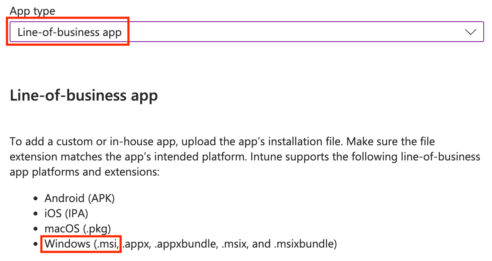
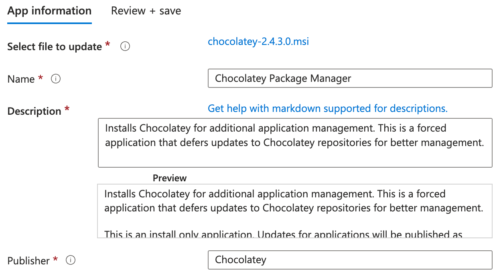
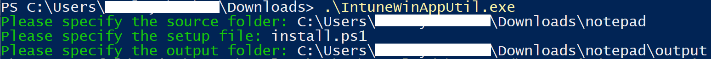
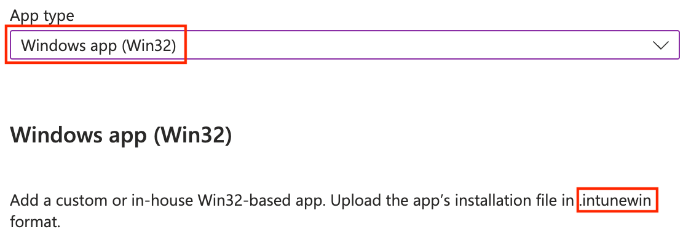

Chocolatey is a package management tool built for Windows, similar to Brew for macOS or `apt` or `yum` for Linux. Intune applications, especially in larger environments or a smaller team managing many clients like an MSP, can be somewhat cumbersome in their management.

## Step 1: Install Chocolatey
### via MSI Installer
Head to https://github.com/chocolatey/choco/releases to download the latest `.msi` file to deploy.

Once acquired, head to Intune > Apps > All Apps. Click "Create".

In the "App type" dropdown, select "Line-of-business app".



Title the app, fill in the description, and list the publisher.



Assign and deploy Chocolatey. That's it!

### via Chocolatey script
You can also opt to deploy the installer via a script. I would recommend installing it via a Remediation script, but you can also utilize Platform scripts since this only needs to be ran successfully once.

> You must have your execution policy set to `Bypass` or `AllSigned` to run this.
{: .prompt-tip}

```powershell
Set-ExecutionPolicy Bypass -Scope Process -Force;
[System.Net.ServicePointManager]::SecurityProtocol = [System.Net.ServicePointManager]::SecurityProtocol -bor 3072;
iex ((New-Object System.Net.WebClient).DownloadString('https://community.chocolatey.org/install.ps1'))
```

1. Go to [https://chocolatey.org/install](https://chocolatey.org/install) and select "Individual" for "Choose How to Install Chocolatey".
2. Scroll down and copy the listed command.
3. Save the copied command in a `.ps1` file.
4. Go to Intune > Devices > Scripts and remediation.
5. Create and deploy the script as you see fit.

## Step 2: Write and wrap application installation commands to .intunewin file
Now that Chocolatey is installed properly, let's install a package! Installing packages is extremely easy and run on the same concept of installing them on your own local machine. Each package will consist of only two items: an install script and an uninstall script.

For an install script:

```powershell
$appname = "notepadplusplus"
$localprograms = choco list

if ($localprograms -like "*$appname*")
{
    #choco upgrade $appname
}
else
{
    choco install $appname -y
}
```

I opted to not conduct any action here for upgrading the application if it already exists as I handle those separately and more frequently (see [step 4](#step-4-optional-write-and-deploy-automatic-updates-for-chocolatey-packages)).

For an uninstall script:

```powershell
$appname = "notepadplusplus"

choco uninstall $appname -y --limit-output
choco uninstall ($appname + ".install") -y --limit-output

$localprograms = choco list
#Write-Output($localprograms)
foreach($program in $localprograms) {
    if($program -like "*$appname*") {
        choco uninstall $appname -y --limit-output
    }
}
```

Save these two files in the same folder. Then, using the [IntuneWinWrapTool](https://github.com/microsoft/Microsoft-Win32-Content-Prep-Tool), wrap this folder.



## Step 3: Deploy an application
With your new `.intunewin` file, head to Intune > Apps > All apps. Select "Create", then "Windows app (Win32)".



Fill out the application details as you normally would. Use `powershell.exe -executionpolicy bypass .\install.ps1` and `powershell.exe -executionpolicy bypass .\uninstall.ps1` for your install and uninstall commands.

You can choose to look for the proper install location for an application in your detection rules or you can look at the Chocolatey folder. In this case, Notepad++ installs in the proper folder of `C:\Program Files\Notepad++`. It also appears from Chocolatey in the folder `C:\ProgramData\chocolatey\lib\notepadplusplus`. Either are totally valid ways to detect your application, it is up to you how you decide to do it.

## Step 4 (optional): Write and Deploy automatic updates for Chocolatey packages
After doing the above, it's a good idea to keep Chocolatey and all the packages with it up to date. There are myriad of ways to accomplish this; I'll be doing the broadest method, which is to upgrade anything that has an update ever. This is easy enough to undo in the future if a bad package comes out (i.e., delete the script and rewrap your application with the install command flag of `--version=123 --force`).

The script below:
- Creates a folder called "ChocoStartup" to store `update.ps1` and `choco_update.log` in, then determines the Windows Startup folder.
- Creates `update.ps1` with a file that will automatically run `choco update all` on startup and log anything that comes back as needing an upgrade.
- Creates a shortcut in the Windows Startup folder so that the script executes on startup.

```powershell
# Define paths
$scriptFolder = "C:\ProgramData\ChocoStartup"
$scriptPath = "$scriptFolder\update.ps1"
$logPath = "$scriptFolder\choco_update.log"
$startupShortcut = "$env:ProgramData\Microsoft\Windows\Start Menu\Programs\Startup\ChocoUpdate.lnk"

# Create folder for script and log
New-Item -ItemType Directory -Path $scriptFolder -Force | Out-Null

# Write the update script with filtered logging
$scriptContent = @"
# Setup
`$logPath = "C:\ProgramData\ChocoStartup\choco_update.log"
`$tempLog = "C:\ProgramData\ChocoStartup\choco_raw_output.tmp"

# Create folder if missing
if (!(Test-Path "C:\ProgramData\ChocoStartup")) {
    New-Item -Path "C:\ProgramData\ChocoStartup" -ItemType Directory -Force
}

# Create temp folder
Set-Content -Path `$tempLog -Value `$null

# Write header
`$(Get-Date -Format "yyyy-MM-dd HH:mm:ss") + " - Starting choco upgrade all"  | Out-File -Append `$logPath

# Run Chocolatey and capture all output
`$cmdLine = `"choco upgrade all -y >> ``"`$tempLog``" 2>&1`"
cmd /c `$cmdLine

# Track output
`$lines = Get-Content `$tempLog
`$filteredOutput = @()
`$upgradeList = @()
`$inUpgradeBlock = `$false

foreach (`$line in `$lines) {
    `$trimmed = `$line.Trim()

    # Collect the package names listed under "Upgrading the following packages:"
    if (`$trimmed -match '^Upgrading the following packages:') {
        `$inUpgradeBlock = `$true
        continue
    }

    if (`$inUpgradeBlock) {
        if (`$trimmed -match '^By upgrading') {
            `$inUpgradeBlock = `$false
            continue
        }
        if (`$trimmed -ne "") {
            `$upgradeList += `$trimmed
        }
        continue
    }

    # Match the actual version upgrade notification
    if (`$trimmed -match '^You have .+ v[\d\.]+ installed\. Version [\d\.]+ is available') {
        `$filteredOutput += `$trimmed
    }

    # Add any successful confirmation lines just in case
    if (`$trimmed -match 'Successfully installed|was upgraded') {
        `$filteredOutput += `$trimmed
    }
}

# Add upgrade header if real packages are listed (and not just 'all')
if (`$upgradeList.Count -gt 0 -and -not (`$upgradeList -eq 'all')) {
    `$filteredOutput = @("Upgrading the following packages:") + `$upgradeList + `$filteredOutput
}

# Write filtered results
if (`$filteredOutput.Count -gt 0) {
    `$filteredOutput | Out-File -Append `$logPath
} else {
    "No packages needed upgrading." | Out-File -Append `$logPath
}
# Write footer
`$(Get-Date -Format "yyyy-MM-dd HH:mm:ss") + " - Finished choco upgrade all" | Out-File -Append `$logPath

# Clean up tmp
Remove-Item `$tempLog -Force -ErrorAction SilentlyContinue
"@

# Write the script to disk
Set-Content -Path $scriptPath -Value $scriptContent -Force

# Create shortcut in Startup folder
$WshShell = New-Object -ComObject WScript.Shell
$shortcut = $WshShell.CreateShortcut($startupShortcut)
$shortcut.TargetPath = "powershell.exe"
$shortcut.Arguments = "-ExecutionPolicy Bypass -WindowStyle Hidden -File `"$scriptPath`""
$shortcut.WorkingDirectory = $scriptFolder
$shortcut.Save()
```

And of course, a detection script for deployment as a Remedition within Intune.

```powershell
Test-Path "C:\ProgramData\ChocoStartup\update.ps1" -and Test-Path "$env:ProgramData\Microsoft\Windows\Start Menu\Programs\Startup\ChocoUpdate.lnk"
```

## References
- [https://techcommunity.microsoft.com/discussions/microsoft-intune/simple-method-to-run-logon--recurring-scripts-in-intune/686861](https://techcommunity.microsoft.com/discussions/microsoft-intune/simple-method-to-run-logon--recurring-scripts-in-intune/686861)
- [https://docs.chocolatey.org/en-us/choco/setup/#install-using-the-msi](https://docs.chocolatey.org/en-us/choco/setup/#install-using-the-msi)
