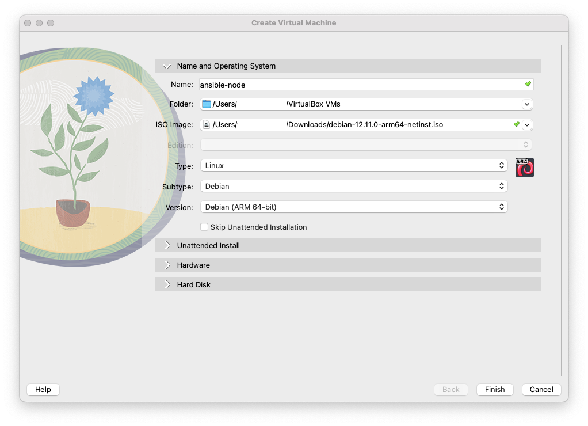
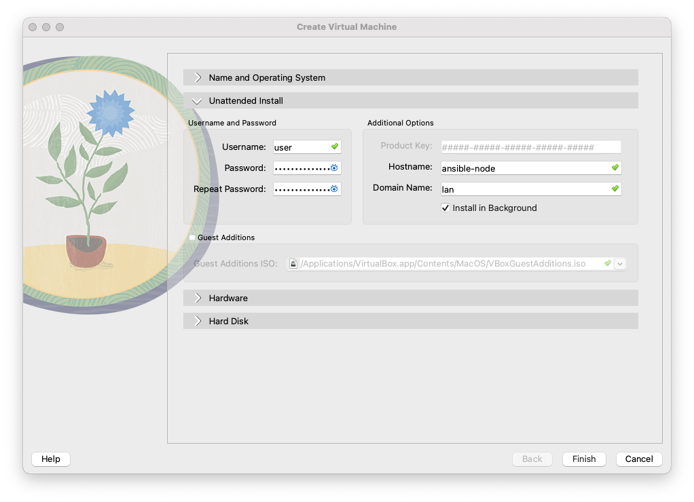
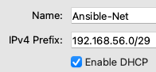
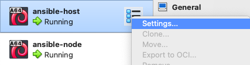
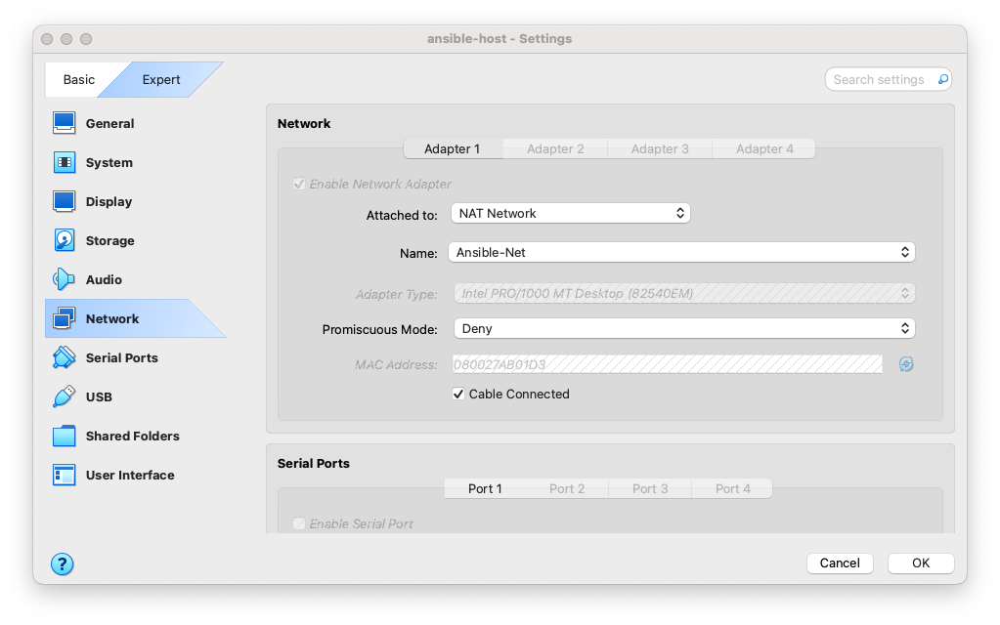
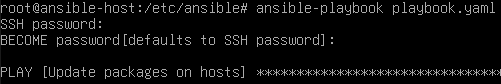
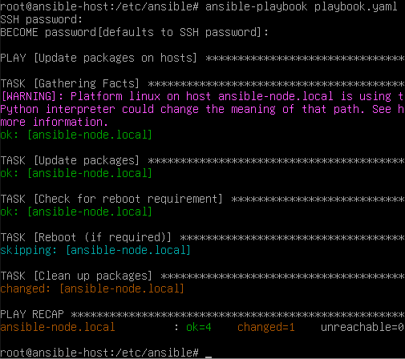

Ansible is a very powerful tool that looks daunting at first. For new users, there isn't a GUI to help you along the way. Everything with Ansible lives in `ini` or `.yaml/.yml` files and it is exclusively command line. But fear not, it's super easy once you learn the syntax and how the tool works.

To start, Ansible requires installation only on the device you'll be "pushing" commands from. Ansible refers to this as the "control node". The devices you're "pushing" the commands to are known as "managed nodes". The control node must be
- UNIX-based (Red Hat, Debian, macOS, BSDs, and Windows with Windows Subsystem for Linux (WSL)), and
- able to run Python

Managed nodes don't require Ansible to be installed, but they must be able to execute the code generated when running an Ansible command from the control node. Ansible generates commands in Python, so managed nodes must be able to run Python. Additionally, managed nodes need to have a method for Ansible to connect through SSH. You can do this through an already existing user account, but it is recommended to have a dedicated user for Ansible. We'll just be using the user "user".

## Building your own Ansible testing environment
I'll be using [VirtualBox](https://www.virtualbox.org) and [Debian 12](https://www.debian.org) in this example.

### Building Machines
#### Create a host VM
Below are the settings I used for my VM. You can copy these exactly or deviate as you wish. 





You can either repeat these steps for your second virtual machine, or you can stop the VM you just created and clone it. You'll need to change the hostname if you do this so we don't run into issue later on.

> With VirtualBox, you'll need to manually set the hostname of the device once it boots. You can do this by signing in as root and running
> 
> ```bash
> hostnamectl set-hostname new-name
> ```
>
> Then run `reboot`. If you are cloning your machine, wait until you've cloned it to change the hostname.
{: .prompt-warning}

I've chosen to name my machines "ansible-host" and "ansible-node" respectively.

#### Connecting to Network
Your machines have been operating under the guise of your physical computer's network. We need to designate that these machines are separate from the physical host. We'll do this by creating a network in our hypervisor. In VirtualBox, we can do this by going to **File** > **Tools** > **Network Manager**. Go to the tab "NAT Networks". Here, I've taken the default IP subnet mask of /24 VirtualBox gave me and shrunk it down to a /29 subnet. I'm a big fan of making networks as small as possible, but this is completely optional. You can learn more about subnets [here](https://www.calculator.net/ip-subnet-calculator.html).



Now we need to attach the machines to this new network we've created. We'll right-click our machines in the VirtualBox sidebar and select "Settings".



Select "Expert" at the top, then select "Network" in the sidebar. Change it from "Attached to: NAT" to "Attached to: NAT Network". Click "OK".



#### Static IP
I've opted to set my Ansible host with a static IP and leave my Ansible node to grab an address from DHCP. To do this, sign in to your host machine with the root user and enter the command:

```bash
nano /etc/network/interfaces
```

By default, we will recieve an address from DHCP. We'll make some changes here to set the static IP.

```diff
# The loopback network interface
auto lo enp0s8
iface lo inet loopback

# The primary network interface
allow-hotplug enp0s8
- iface enp0s8 inet dhcp
+ iface enp0s8 inet static
+  address 192.168.56.2
+  netmask 255.255.255.248
+  gateway 192.168.56.1
+  dns-domain lan
+  dns-nameservers 192.168.56.1
```
{: file='/etc/network/interfaces'}

> You can repeat this process on your node to avoid the "[Virtualization Quirks](#virtualization-quirks-dhcp-only)" section.
{: .prompt-info}

### Add User to sudoers
The final step we need to do before we can move on to the Ansible portion is to modify our user "user" so they can escalate to sudo. This is needed to run the Ansible "become" parameter (we'll touch on that more later). 

On your managed node, sign in as root. Then run:

```bash
usermod -aG sudo user
```

This adds the user "user" to the group "sudo". There will be differences in what the "sudo" group is called across difference distributions (e.g., RedHat calls this group "wheel").

### Installing Ansible
Sign into your control node with the root user. Debian 12 has Python installed but pipx/pip are not, which is required for Ansible. Ansible documentation recommends pipx but you can still install pip and be perfectly fine.

To install pipx, run:
```bash
apt-get install pipx -y
```

Then run:
```bash
pipx install --include-deps ansible
```

Reboot your control node.

After it reboots, login as root again and run
```bash
ansible --version
```

This verifies that Ansible is installed.

We'll also need to install a package that lets Ansible sign in with SSH passwords. To do so, run:
```bash
apt install sshpass -y
```

### Virtualization Quirks (DHCP only)
Virtualization still relies on some of your network hardware to assist in where network traffic is supposed to flow. This can cause some issues when trying to resolve by hostname. Since these are machines we're never going to expose to others and without introducing too many complex pieces, we'll install a piece of software on both the host and the node machines that will help them resolve routes to each other locally. To do this, we'll need to log in to both machines as root and run:
```bash
apt install avahi-daemon
```

Avahi is a local mDNS/DNS-SD protocol suite that helps identify machines on the local network without needing to rely on a router. A caveat is that you MUST suffix hostnames with `.local`. For our testing environment this is perfectly fine. **Do not** do this in production.

## Playbooks
We can write playbooks of varying complexity, from simply rebooting to completely setting up a new machine with very specific parameters. The sky really is the limit with Ansible. I'll go over a relatively simple playbook that will run update commands, install them, and reboot the machine if a kernel update was installed.

You can store your playbooks anywhere on the device. However this varies based on how administrators will be accessing the control node. I personally like to store them in `/etc/ansible` which I'll be doing here.

To get started, we need three files: an inventory file, a playbook, and a config file. To create these, run:
```bash
touch inventory.yaml playbook.yaml ansible.cfg
```

### Inventory File
Inside of `inventory.yaml`, we need to list our node machine that we created.

```diff
+ ungrouped:
+   hosts:
+     ansible-node.local:
```
{: file='inventory.yaml'}

This is a very basic way of using the inventory file, but will suffice for our purposes. We don't include our host machine since it was not good practice to update the machine you are currently orchestrating updates from. To address this, you can create another control node and store the playbooks in a common location that both can access. You can also run these commands manually on the machine. **Do not** run Ansible playbooks against your current machine.

### Creating Playbooks
Next, we need to tell Ansible what commands we want it to execute on our node. We do this within the `playbook.yaml` file. You can name playbooks whatever you want.

To start, our playbook needs a name and a few parameters. You must include a name, hosts, and at least one task.

```diff
+ - name: Update packages on hosts
+   hosts: all
+   become: true
+   tasks:
+
+     - name: Update packages
+       apt:
+         update_cache: yes
+         cache_valid_time: 3600
+         upgrade: yes
```
{: file='playbook.yml'}

I recommend including "become" in this playbook. "Become" allows for the user the Ansible is executing these commands as to escalate to root (of course, if the operating system allows that user to do so). Root is required to run these update commands, so we should include it in this playbook.

From here, you can include anything that you want the playbook to execute on your nodes. Keeping with our original intent, this is the playbook that we'll be playing with:

```diff
 - name: Update packages on hosts
  hosts: all
  become: true
  tasks:

    - name: Update packages
      apt:
        update_cache: yes
        cache_valid_time: 3600
        upgrade: yes
+ 
+   - name: Clean up packages
+     apt: 
+       autoremove: yes
+       clean: yes
+
+   - name: Check for reboot requirement
+     stat:
+       path: /var/run/reboot_required
+     register: reboot_required_file
+
+   - name: Reboot (if required)
+     reboot:
+       msg: "Reboot initiated by Ansible"
+     when: reboot_required_file.stat.exists
```
{: file='playbook.yml'}

To break it down, our tasks will:
1. Update the cache of our apt packages if it is older than 3600 seconds, then execute an upgrade (this is equivalent to running `sudo apt-get update && sudo apt-get upgrade -y`)
2. Clean up packages (equivalent to `sudo apt autoremove`).
3. Look for a file at the path `/var/run/reboot_required`. This is a file that is created when a kernel update is installed, and what causes the `***System reboot required***` message to appear when you sign in.
4. If that file exists, it will reboot the machine with a message.

> Ansible persists across reboots.
>
> If you reboot a machine during an Ansible playbook (for example, if we decided to clean up packages after our reboot), Ansible will automatically reconnect back to the machine and continue running the playbook.
{: .prompt-tip}

### Set up config file
There are a couple of things we are going to put into our `ansible.cfg` file. These will make our lives easier because their values will be automatically included.

```diff
+ [defaults]
+ inventory = inventory.yaml
+ ask_pass = true
+
+ [privilege_escalation]
+ become_ask_pass = True
```
{: file='ansible.cfg'}

Here, we're telling Ansible the defaults we want for every execution of playbooks. The first entry declares that our default inventory file is `inventory.yaml`. The second declares `ask_pass` and sets it to true. This value makes Ansible ask for an SSH password on our execution of playbooks. Since we don't use SSH keys here, setting this to try prevents us from having to add `--ask-pass` to every command. Next, in the "privilege escalation" section, we set `become_ask_pass` to true. This is very similar to `ask_pass` in that a password will be asked for, however that password will be used for escalating to sudo if needed. In this environment, our user and root passwords are the same so it makes our lives just a little easier. In this case, it keeps us from having to enter `--ask-become-pass` every time we execute a playbook. We'll see these in action in a moment.

### Running Playbooks
> It is recommended on more complex playbooks that you test them properly. You can do so with the `--check` flag (e.g., `ansible-playbook playbook.yml --check`) or by using tools like [Molecule](https://ansible.readthedocs.io/projects/molecule/) or [Vagrant](https://developer.hashicorp.com/vagrant). We won't be covering those here.
{: .prompt-info}

Once we have our inventory set up and our playbook written, it's time to run it! Doing so is very simple. 

Below, we are declaring that we are running a playbook and the playbook name. If we wanted, we could reference our inventory file directly with the `-i` flag. Since we included that in our config file, it isn't necessary here.

```bash
ansible-playbook playbook.yaml
```

You should have the following appear in your console. This indicates that the playbook is running.



> If we hadn't included our config file, our execution file would be the following
> 
> ```bash
> ansible-playbook playbook.yaml -i inventory.yaml --ask-pass --ask-become-pass
> ```
>
> We'd need to run this command every time. With the config file, we simplified it. Now this is not always feasible based on environment size and setup but you can tweak the config file to your liking.
{: .prompt-info}

Once it is complete, you'll be displayed the following:



Congrats! You've just created and run your first Ansible playbook. Ansible is used across the world in all sorts of use cases. Simple updates like this are very common, and of course configuring brand new machines.

Keep in mind that you can target a single device or specific groups of devices depending on your inventory file (`--limit`).

## Next steps
- Clone a few more VMs of your node and update your inventory file, then run our playbook.
- Write another playbook installing avahi-daemon from earlier on a brand new VM. You'll need to set up your user manually first, but once you've done that, update your inventory file with the IPs of your nodes (you can't do hostname in this example until the daemon is installed) and run the playbook.

## References
- [https://docs.ansible.com/ansible/latest/installation_guide/intro_installation.html](https://docs.ansible.com/ansible/latest/installation_guide/intro_installation.html)
- [https://docs.ansible.com/ansible/latest/collections/ansible/builtin/index.html](https://docs.ansible.com/ansible/latest/collections/ansible/builtin/index.html)
- [https://avahi.org/](https://avahi.org/)
- [https://github.com/thackmaster/homelab/tree/main/ansible/playbooks](https://github.com/thackmaster/homelab/tree/main/ansible/playbooks)
